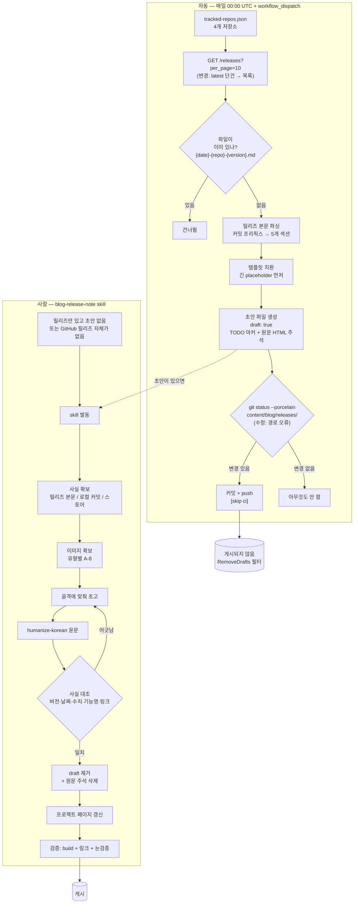
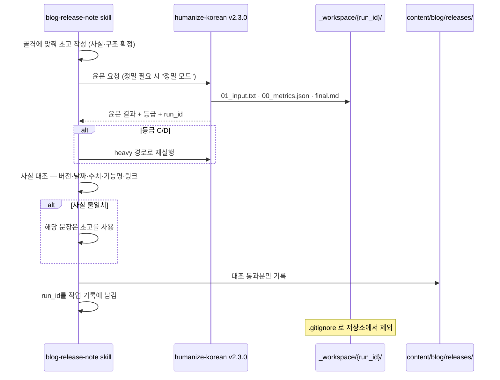

# 블로그 릴리즈 노트 골격 + 작성 skill 설계서

> 근거: `requirements.md` · `plan.md` (둘 다 `status: approved`)
> 골격: `requirements.md` 부록 A (A-0 ~ A-8)

## 1. 설계 개요

릴리즈 노트를 만드는 통로를 **하나**로 만든다. 자동 스크립트는 사실을 긁어 **초안**을 만드는 역할로 내려오고,
사람이 skill을 거쳐 그 초안을 읽을 글로 완성한다. 골격은 템플릿 파일 하나에 못 박고, skill과 스크립트가
같은 파일을 근거로 삼는다.

세 갈래로 나눠 설계한다.

1. **골격** — `content/templates/new_releases.md` 를 12섹션 구조로 교체하고, 사람이 채울 자리를 `TODO` 마커로 표시한다
2. **파이프라인** — `sync-releases.mjs` 가 미동기화 릴리즈를 전부 잡아 `draft: true` 초안을 만들고, 워크플로가 그것을 커밋한다
3. **작성 절차** — `.claude/skills/blog-release-note/` 가 초안 또는 백지에서 글을 완성한다. 문장은 반드시 `humanize-korean` 을 거친다

## 2. 영향 범위

| 파일 · 디렉토리 | 변경 성격 | 근거 |
|----------------|----------|------|
| `content/templates/new_releases.md` | **교체** | FR-01 |
| `scripts/sync-releases.mjs` | 수정 (섹션 빌더·placeholder·목록 조회·draft) | FR-04, FR-05, FR-12 |
| `.github/workflows/sync-releases.yml` | 수정 (경로 3곳) | FR-06 |
| `.claude/skills/blog-release-note/` | **신규** (SKILL.md + references 3) | FR-02, FR-03, FR-08~FR-10, FR-13 |
| `.gitignore` | 1줄 추가 (`_workspace/`) | FR-13 ④, R-10 |
| `content/blog/releases/*.md` | 보정 7건 + 신규 2건 | FR-07, FR-12 |
| `quartz/static/<slug>/` | 이미지 신규 | FR-10 |
| `content/projects/*.md` | 최신 상태 줄 갱신 | FR-09 |
| `CLAUDE.md` | 경로 기술 정정 | FR-11 |
| `quartz/` (엔진 코드) | **변경 없음** | Out of scope |

## 3. 구조

### 3-1. 릴리즈 노트 생성 파이프라인



**초안은 게시되지 않는다.** `quartz.config.ts:85` 의 `Plugin.RemoveDrafts()` 가 `draft: true` 를 빌드에서 제외한다
(현재 빌드 로그의 "Filtered out 10 files"가 그 동작이다). 사람이 손대지 않은 릴리즈는 저장소에만 남는다 — D-02가 의도한 결과다.

### 3-2. 문장 작성 경로 (FR-13)



## 4. 컴포넌트

| 이름 | 위치 | 책임 | 신규/변경 |
|------|------|------|----------|
| 골격 템플릿 | `content/templates/new_releases.md` | 12섹션 구조와 placeholder를 정의하는 단일 근거 | **교체** |
| 릴리즈 수집기 | `scripts/sync-releases.mjs` → `fetchReleases()` | 저장소별 미동기화 릴리즈 목록 조회 | 변경 (`getLatestRelease` 대체) |
| 본문 분류기 | 같은 파일 → `parseReleaseNotes()` | 커밋 프리픽스를 골격 섹션으로 매핑 | 변경 (5분류 → 5분류, 매핑 재정의) |
| 초안 생성기 | 같은 파일 → `generateMarkdown()` | 치환 + TODO 마커 + 원문 주석 삽입 | 변경 |
| 동기화 워크플로 | `.github/workflows/sync-releases.yml` | 초안을 커밋·push | 변경 (경로) |
| skill 본체 | `.claude/skills/blog-release-note/SKILL.md` | 발동 조건 · 절차 · 검증 | **신규** |
| 골격 레퍼런스 | `.../references/skeleton.md` | 12섹션 상세 + 마일스톤 변형 + frontmatter | **신규** |
| 이미지 가이드 | `.../references/images.md` | 유형별 확보 방법 · 변환 · 용량 | **신규** |
| 문체 가이드 | `.../references/writing.md` | humanize 경유 절차 · 금지 목록 · 사실 대조 | **신규** |

## 5. 인터페이스 · 계약

### 5-1. placeholder 계약 (FR-05)

**폐기 4개** — `{{AUTHOR_SECTION}}`(D-04) · `{{ISSUES_URL}}`(Try it에서 불필요) · `{{PERMALINK}}`(템플릿에서 미사용) · `{{RAW_BODY_SECTION}}`(원문 덤프는 골격에 부적합 → 주석으로 이전)

**유지 10개**

| placeholder | 값 | 예 |
|-------------|-----|-----|
| `{{DATE_PREFIX}}` | 파일명·제목용 날짜 (A-6 우선순위) | `2026-02-23` |
| `{{DATE}}` | 본문·frontmatter 날짜 | `2026-02-23` |
| `{{DISPLAY_NAME}}` | tracked-repos의 표시명 | `AI Config Monitor` |
| `{{TAG_NAME}}` | 태그 그대로 | `v1.2.0` |
| `{{VERSION}}` | `v` 제거 | `1.2.0` |
| `{{DESCRIPTION}}` | tracked-repos의 설명 | `AI 설정 모니터링 도구` |
| `{{CATEGORY}}` | 태그용 분류 | `tool` |
| `{{REPO}}` | 저장소명 | `ai-config-monitor` |
| `{{RELEASE_URL}}` | 릴리즈 페이지 | `https://github.com/.../tag/v1.2.0` |
| `{{REPO_URL}}` | 저장소 | `https://github.com/4sizn/ai-config-monitor` |

**신규 8개**

| placeholder | 값 | 비었을 때 |
|-------------|-----|----------|
| `{{BREAKING_SECTION}}` | `⚠️ Breaking Changes` 섹션 (있을 때만) | 빈 문자열 → 섹션 없음 |
| `{{WHATS_NEW_SECTION}}` | `✨ What's New` — `feat:` 항목을 `###` 후보로 나열 + TODO 마커 | TODO 마커만 |
| `{{IMPROVEMENTS_SECTION}}` | `🔧 Improvements` — `chore`·`style`·`docs`·미분류 | 빈 문자열 |
| `{{BUGFIXES_SECTION}}` | `🐛 Bug Fixes` — `fix:` | 빈 문자열 |
| `{{UNDER_HOOD_SECTION}}` | `⚙️ Under the Hood` — `perf`·`refactor`·`build`·`deps` | 빈 문자열 |
| `{{HERO_TODO}}` | Hero Image 자리 TODO 마커 | 항상 삽입 (FR-10 필수) |
| `{{WHATS_NEXT_TODO}}` | `🔜 What's Next` 자리 TODO 마커 | 항상 삽입 |
| `{{SOURCE_BODY_COMMENT}}` | 원본 릴리즈 본문을 `<!-- -->` 로 감싼 근거 블록 | 본문이 없으면 빈 문자열 |

**치환 순서 규칙** — 접두가 겹치는 키(`{{DATE}}` ⊂ `{{DATE_PREFIX}}`)가 있으므로
**키 길이 내림차순으로 치환**한다. 현재 코드는 `Object.keys` 정의 순서에 의존해 우연히 안전한 상태다
(`{{DATE_PREFIX}}` 가 `{{DATE}}` 보다 먼저 정의됨, `sync-releases.mjs:159,167`). 명시적으로 정렬해 고정한다.

```javascript
Object.keys(replacements)
  .sort((a, b) => b.length - a.length)   // 긴 키 먼저 — 접두 충돌 방지
  .forEach(key => { template = template.split(key).join(replacements[key]); });
```

`new RegExp(key, 'g')` 대신 `split().join()` 을 쓴다. `{` 는 정규식 수량자 문자라 리터럴 취급에 의존하고 있었다.

### 5-2. TODO 마커 형식

사람이 채울 자리를 한 가지 형식으로 통일한다. 게시 전에 **0건**이어야 한다.

```markdown
<!-- TODO(hero): 이번 릴리즈를 한 장으로 보여주는 이미지. 확보 방법은 references/images.md -->
<!-- TODO(whats-new): 기능마다 "왜 만들었는지 / 무엇이 달라졌는지"를 채운다. 아래는 커밋에서 뽑은 후보다 -->
<!-- TODO(next): 다음 버전 방향. 미정이면 "미정"이라고 쓴다 -->
```

검증: `grep -c "TODO(" <파일>` == 0 (FR-07 수용 기준에 추가)

### 5-3. 릴리즈 목록 조회 (FR-12)

```javascript
// 변경 전: GET /repos/{owner}/{repo}/releases/latest   ← 단건. 같은 날 여러 릴리즈면 앞엣것 누락
// 변경 후: GET /repos/{owner}/{repo}/releases?per_page=10
```

- 응답을 `published_at` **오름차순**으로 정렬해 오래된 것부터 처리한다 (릴리즈 순서대로 파일이 쌓인다)
- 각 릴리즈마다 파일 존재 검사 → 있으면 건너뛴다 (기존 동작 유지, 덮어쓰지 않는다)
- `draft`·`prerelease` 릴리즈는 제외한다
- `per_page=10` 은 rate limit과 누락 방지의 절충이다. 10건 이상 밀린 저장소는 수동 실행으로 처리한다

### 5-4. skill 인터페이스

```yaml
---
name: blog-release-note
description: "4sizn 블로그(content/blog/releases/)의 릴리즈 노트를 골격에 맞춰 쓴다.
  릴리즈 노트·새 버전 글·스토어 등록 글·마일스톤 기록 요청에 사용한다.
  GitHub 릴리즈, App Store 앱, 버전 없는 마일스톤 모두 다룬다.
  문장은 humanize-korean 을 반드시 거치고, 이미지를 최소 1장 넣는다."
version: 1.0.0
---
```

발동 문구(NFR-04): "릴리즈 노트", "release note", "새 버전 글", "릴리즈 글 써줘", "스토어 등록 글", "마일스톤 기록"

## 6. 데이터 흐름

**입력 3종** (FR-03)

| 입력원 | 사실 확보 | 확보 실패 시 |
|--------|----------|-------------|
| GitHub 릴리즈 | `gh release view <tag> --repo <owner>/<repo> --json body,publishedAt,assets` | 릴리즈가 없으면 다음 입력원으로 |
| 로컬 레포 · 원격 커밋 | `git log <prev>..<tag>` (로컬) 또는 `gh api repos/{o}/{r}/compare/{a}...{b}` (원격) | 근거 없는 섹션은 **생략**한다 |
| 마일스톤 (버전 없음) | 작업한 커밋 · 산출물 파일 직접 확인 | 사용자에게 무엇을 기록할지 묻는다 |

**날짜** (A-6): `published_at` → 태그 커밋 날짜 → `gh repo view --json pushedAt`

**이미지** (A-8): 유형별 확보 → `sips -s format jpeg -s formatOptions 82` 변환 → `quartz/static/<slug>/` → 장당 300KB 이하 확인

**실패 경로**
- `humanize-korean` 부재/실패 → **작업을 멈추고 사용자에게 알린다.** 우회 작성 금지 (R-11)
- 사실 대조 불일치 → 해당 문장만 초고로 되돌린다 (전체 재윤문 아님)
- 이미지 확보 불가 → 생략 + 이유를 작업 기록에 남긴다 (억지 장식 금지, R-14)

## 7. 설계 결정

| # | 결정 | 버린 대안 | 선택 이유 |
|---|------|----------|----------|
| DD-01 | 자동 생성물은 `draft: true` + TODO 마커가 박힌 **초안** | 자동 생성 폐지하고 skill이 백지에서만 쓴다 | 사실 수집(릴리즈 본문·링크·날짜)은 기계가 더 정확하고 빠르다. 서사만 사람이 채우면 된다 |
| DD-02 | 원본 릴리즈 본문을 **HTML 주석**으로 초안에 넣고, 게시 전 삭제 | ① 별도 파일로 저장 ② 그냥 버림 | 다듬는 사람이 같은 파일에서 근거를 본다. 별도 파일은 초안과 짝이 어긋나고, 버리면 근거 추적이 불가능해진다 (R-06 대응) |
| DD-03 | placeholder 치환을 **키 길이 내림차순 + `split/join`** 으로 고정 | 현재의 `Object.keys` 순서 + `new RegExp` | `{{DATE}}` 가 `{{DATE_PREFIX}}` 를 깨뜨릴 수 있는 구조다. 지금은 정의 순서 덕에 우연히 동작한다 — 키를 하나 추가하면 깨진다 |
| DD-04 | skill을 `SKILL.md` + `references/` 3파일로 분할 | 단일 `SKILL.md` | 골격·이미지·문체를 한 파일에 넣으면 발동할 때마다 전부 읽는다. 필요한 것만 읽게 나눈다 |
| DD-05 | `humanize-korean` 은 **저장소 루트에서 실행**하고 `_workspace/` 를 `.gitignore` 에 넣는다 | scratchpad로 `cd` 한 뒤 실행 | 스킬이 cwd 기준으로 동작하고 입력 파일 경로도 cwd 기준이다. 디렉토리를 옮기면 경로가 어긋난다. 1줄 ignore가 더 싸다 |
| DD-06 | 릴리즈 목록 조회는 `per_page=10` + 오름차순 처리 | ① 태그 전량 조회 ② `latest` 유지 | 전량은 rate limit을 쓰고 대부분 이미 있는 파일이다. `latest` 유지는 FR-12 위반 |
| DD-07 | `What's New` 는 `feat:` 항목을 **후보 목록**으로만 뽑고 서사는 TODO | 커밋 메시지를 그대로 `###` 제목으로 승격 | 커밋 메시지를 제목으로 쓰면 지금의 나열형 글로 되돌아간다 (문제 1) |
| DD-08 | 이미지 경로는 `quartz/static/<project-slug>/` | ① `static/` 평면 배치 ② `content/` 안에 배치 | 평면 배치는 프로젝트가 늘면 섞인다. `content/` 안은 Quartz가 페이지로 오해할 수 있다 |
| DD-09 | 커밋 프리픽스 매핑에서 `perf`·`refactor` 를 **Under the Hood** 로 분리 | 기존처럼 `chore`·`refactor`·`perf`·`style` 을 모두 Improvements로 | 골격에 `⚙️ Under the Hood` 가 생겼다. 내부 변경과 사용자가 체감하는 개선을 섞으면 독자가 걸러 읽어야 한다 |
| DD-10 | `4sizn-blog` 이미지는 **worktree로 당시 커밋 재현** | 현재 화면 캡처 + 캡션에 시점 명시 | 2월 글에 8월 화면을 넣으면 사실과 어긋난다. 당시 Quartz가 지금과 같은 4.5.2라 재현 비용이 낮다 (D-11) |
| DD-11 | 릴리즈 조회는 **`per_page=10` 고정**. 10건 이상 밀리면 `workflow_dispatch` 수동 실행으로 처리한다 | ① 페이지네이션 구현 ② `per_page` 를 저장소별 설정으로 노출 | 현재 최다가 `ai-config-monitor` 5건이다. 페이지네이션은 지금 필요 없는 복잡도이고, 밀리는 경우가 실제로 생기면 그때 넣는다 (2026-08-11 확정) |
| DD-12 | 소급 보정 7건에는 **원문 릴리즈 본문 주석을 넣지 않는다** | 7건에도 DD-02를 적용해 원문 주석 삽입 | 보정 작업 자체가 GitHub 릴리즈를 근거로 하고, `🚀 Try it` 에 릴리즈 링크가 남는다. 주석을 넣으면 파일만 길어진다. DD-02는 **앞으로 만들 초안**에만 적용한다 (2026-08-11 확정) |

## 8. 요구사항 추적

| 요구사항 | 설계 반영 |
|---------|----------|
| FR-01 골격 템플릿 | §4 골격 템플릿, §5-1 placeholder, §5-2 TODO 마커 |
| FR-02 skill 작성 | §4 skill 본체, §5-4 인터페이스 |
| FR-03 입력원 3종 | §6 입력 3종 표 |
| FR-04 draft 초안화 | §3-1 (RemoveDrafts), DD-01 |
| FR-05 placeholder 계약 | §5-1 (폐기 4 · 유지 10 · 신규 8), DD-03 |
| FR-06 워크플로 경로 | §3-1 다이어그램 G노드, §2 영향 범위 |
| FR-07 소급 보정 7건 | §5-2 TODO 0건 검증, §6 실패 경로, DD-02 |
| FR-08 마일스톤 규칙 | §4 `references/skeleton.md`, §6 입력원 3번 |
| FR-09 프로젝트 페이지 갱신 | §3-1 Q노드 |
| FR-10 이미지 최소 1장 | §4 `references/images.md`, §6 이미지 흐름, DD-08, DD-10 |
| FR-11 CLAUDE.md 정정 | §2 영향 범위 |
| FR-12 다중 릴리즈 조회 | §5-3, DD-06 |
| FR-13 humanize 강제 | §3-2 시퀀스, §4 `references/writing.md`, DD-05 |
| NFR-01 문체 | §4 `references/writing.md`, DD-07 (커밋 제목 승격 금지) |
| NFR-02 빌드·링크 | §3-1 R노드 (build + 링크 + 눈검증) |
| NFR-03 이미지 용량 | §6 이미지 흐름 (`sips` 변환 + 300KB) |
| NFR-04 발동 정확도 | §5-4 description + 발동 문구 |
| NFR-05 파이프라인 안정성 | §3-1 (`[skip ci]`·bot 제외 조건 유지), §5-3 (draft·prerelease 제외) |
| NFR-06 검증 단계 | §3-1 human 서브그래프 마지막 노드 |

**빈 칸 없음** — FR 13건 · NFR 6건 전부 대응.

## 9. 리스크 · 미확인

설계 단계에서 드러난 2건은 **2026-08-11 확정됐다** (미확인 0건).

| 쟁점 | 결정 | 반영 |
|------|------|------|
| `per_page` 크기 | `10` 고정, 밀리면 수동 실행 | DD-11 |
| 소급 보정 7건에 원문 주석 | 넣지 않는다. DD-02는 앞으로 만들 초안에만 | DD-12 |

기존 리스크 중 설계로 완화된 것:

| 리스크 | 완화 |
|--------|------|
| R-06 사실 날조 | DD-02 원문 주석 + §6 "근거 없는 섹션은 생략" |
| R-09 윤문이 사실 변경 | §3-2 사실 대조 루프 (문장 단위 되돌리기) |
| R-10 `_workspace/` 오염 | DD-05 `.gitignore` 1줄 |
| R-14 억지 이미지 | §6 실패 경로 (생략 + 이유 기록) |

## 10. 승인

- [x] 모든 요구사항이 추적표에서 설계에 대응되는가 (§8 — 빈 칸 없음)
- [x] 설계 결정의 이유가 기록되었는가 (§7 — DD-01~DD-12, 버린 대안 포함)
- [x] §9 미확인 2건에 답했다 (2026-08-11 — DD-11·DD-12)

**2026-08-11 4sizn 승인 완료** (`status: approved`). 다음 단계는 `/sdlc:implement`.

착수 순서는 `plan.md` 3절 세션 순서를 따른다 — S1(골격) → S2(파이프라인) → S3(skill) → S4(이미지) → S5(글 9건).
첫 작업은 **W-01 골격 템플릿**이며, W-03·W-06·W-10 이후가 전부 여기에 의존한다.
