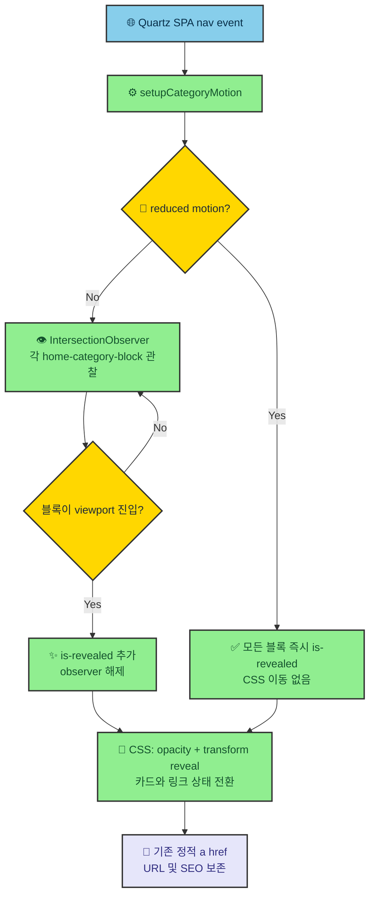

# 4sizn Blog 시각적 모션 개선 설계서

> 근거: `requirements.md` · `plan.md` (둘 다 `status: approved`, 2026-08-11)

## 1. 설계 개요

`blog/index`에만 렌더되는 `HomeCategoryThumbnails`를 작은 모션 경계로 삼는다. 기본 HTML은 JavaScript 없이도 이미 보이고 클릭 가능하게 둔다. 해당 컴포넌트의 after-DOM script가 Quartz SPA의 `nav` 이벤트에서만 `IntersectionObserver`를 연결해 각 카테고리에 `.is-revealed`를 추가한다. CSS는 observer가 추가한 상태에서만 reveal을 실행한다.

카드와 `더 보기` 링크는 CSS transition으로 처리한다. 애니메이션 대상은 `transform`, `opacity`, `border-color`, `background-color`, `color`로 한정한다. `prefers-reduced-motion: reduce`에서는 observer가 즉시 reveal 상태만 붙이고 CSS의 이동, 확대, stagger를 적용하지 않는다. 이 방식은 새 런타임 라이브러리 없이 Quartz의 정적 생성 및 SPA navigation 계약을 따른다.

## 2. 영향 범위

| 파일                                                     | 변경 성격 | 근거                                                                                  |
| -------------------------------------------------------- | --------- | ------------------------------------------------------------------------------------- |
| `quartz/components/HomeCategoryThumbnails.tsx`           | 수정      | FR-01, FR-02, FR-03, FR-07. 안정적인 motion hook과 after-DOM resource 연결            |
| `quartz/components/scripts/homeCategoryMotion.inline.ts` | 신규      | FR-01, FR-05, FR-06, NFR-05. `nav` + `IntersectionObserver` lifecycle                 |
| `quartz/components/styles/homeCategoryThumbnails.scss`   | 수정      | FR-02, FR-03, FR-04, FR-06. 카드, 썸네일, 링크의 상태 전환                            |
| `quartz/styles/custom.scss`                              | 수정      | FR-05, NFR-01. 공통 easing, duration, focus token을 재사용 또는 역할별 token으로 정리 |
| `quartz.layout.ts`                                       | 변경 없음 | `blog/index`에 이미 `HomeCategoryThumbnails`가 conditional render됨                   |
| 글 콘텐츠, URL, Explorer, Graph                          | 변경 없음 | FR-07 및 out of scope                                                                 |

## 3. 구조



### 3-1. SPA lifecycle

1. Quartz가 첫 로드와 SPA back/forward 후 `nav` 이벤트를 발행한다.
2. script는 현재 문서에서 `.home-category-thumbnails`가 없으면 즉시 종료한다.
3. 이전 observer가 있다면 disconnect한다. 새 root의 `.home-category-block`만 관찰한다.
4. motion reduce이면 각 block에 `.is-revealed`만 추가하고 observer를 만들지 않는다.
5. 일반 모드이면 `IntersectionObserver`가 첫 진입 시 `.is-revealed`를 추가한 뒤 해당 block을 unobserve한다.
6. `window.addCleanup`으로 observer disconnect를 등록한다. Quartz가 다음 SPA navigation 전에 cleanup을 실행하므로 stale observer가 이전 DOM을 참조하지 않는다.

## 4. 컴포넌트 · 모듈

| 이름                      | 위치                                                     | 책임                                                                                | 신규/변경 |
| ------------------------- | -------------------------------------------------------- | ----------------------------------------------------------------------------------- | --------- |
| `HomeCategoryThumbnails`  | `quartz/components/HomeCategoryThumbnails.tsx`           | category/card/link에 motion hook을 부여하고 script resource를 attach한다            | 변경      |
| `homeCategoryMotion`      | `quartz/components/scripts/homeCategoryMotion.inline.ts` | nav마다 root를 탐색하고 observer setup, cleanup, reduce fallback을 수행한다         | 신규      |
| category motion selectors | `quartz/components/styles/homeCategoryThumbnails.scss`   | block reveal, card pointer/focus/active, thumb hover, more-link feedback을 선언한다 | 변경      |
| shared motion tokens      | `quartz/styles/custom.scss`                              | easing, short duration, rise distance, focus ring 등 공통 값의 단일 근거를 제공한다 | 변경      |

### 4-1. DOM/CSS hook 계약

| 대상          | hook                                           | 최초 상태                                                    | 종료 상태                                                                                              |
| ------------- | ---------------------------------------------- | ------------------------------------------------------------ | ------------------------------------------------------------------------------------------------------ |
| 카테고리 블록 | `.home-category-block[data-motion="category"]` | JS가 준비된 일반 모드에서만 `opacity: 0`, `translateY(12px)` | `.is-revealed`에서 `opacity: 1`, `transform: none`                                                     |
| 카드          | `.home-category-card`                          | 항상 가시, 클릭 가능                                         | hover/focus에 `translateY(-2px)`, thumb `scale(1.02)` 이하, active에 `translateY(0)` 또는 `scale(.99)` |
| 썸네일        | `.home-category-thumb`                         | 예약된 크기 유지                                             | overflow 내부에서만 transform, 기본 썸네일에는 scale 효과를 제외하거나 더 낮춤                         |
| 더 보기       | `.home-category-more`                          | 기존 텍스트/accessible name 유지                             | pseudo-element의 짧은 translateX 또는 underline/색상 변화. focus-visible에서는 focus ring 우선         |

**No-JS 안전성:** CSS의 숨김 selector는 `html[data-home-motion="ready"]` 아래에만 둔다. script가 실행되지 않으면 `data-home-motion`이 없으므로 모든 콘텐츠가 처음부터 보인다.

## 5. 인터페이스 · 계약

### DOM attribute contract

```typescript
type CategoryMotionState = "ready" | "reduced"

// HomeCategoryThumbnails가 생성하는 계약
// <section class="home-category-thumbnails" data-motion-root="category-list">
//   <div class="home-category-block" data-motion="category">...</div>
// </section>

// script가 HTML root에 부여하는 계약
// document.documentElement.dataset.homeMotion = "ready" | "reduced"
// block.classList.add("is-revealed")
```

### 이벤트/cleanup 계약

| 이벤트                 | 입력                             | 처리                                             | 종료                      |
| ---------------------- | -------------------------------- | ------------------------------------------------ | ------------------------- |
| `document:nav`         | Quartz의 현재 URL                | root 탐색, 기존 observer disconnect, reduce 판정 | observer 또는 즉시 reveal |
| `IntersectionObserver` | block 교차 상태                  | 최초 `isIntersecting`에서 `.is-revealed` 추가    | 해당 block unobserve      |
| `window.addCleanup`    | SPA navigation 직전              | observer disconnect                              | stale callback 없음       |
| media query            | `prefers-reduced-motion: reduce` | 이동, 확대, animation 제거                       | 모든 블록 가시 상태       |

## 6. 데이터 흐름

외부 API나 저장 데이터는 없다. `allFiles`에서 기존처럼 category와 page 링크를 정적으로 렌더링한 뒤, 클라이언트에는 이미 렌더된 DOM의 표시 상태만 전달된다.

```text
allFiles → HomeCategoryThumbnails 정적 HTML(a href 유지)
        → nav event → observer 또는 reduced fallback
        → class/attribute → CSS composited motion
        → 사용자 hover/focus/active → CSS feedback
```

실패 시에도 DOM link와 일반 CSS가 남는다. observer 미지원 또는 script error는 motion만 빠지고 콘텐츠 탐색은 유지되는 점진적 향상으로 취급한다.

## 7. 설계 결정

| #     | 결정                                                                     | 버린 대안                                      | 선택 이유                                                                                          |
| ----- | ------------------------------------------------------------------------ | ---------------------------------------------- | -------------------------------------------------------------------------------------------------- |
| DD-01 | 카테고리 reveal은 `IntersectionObserver`로 최초 viewport 진입을 판정한다 | 현재 page-load `fade-up`만 유지                | FR-01의 viewport 최초 진입을 CSS page-load만으로 정확히 표현할 수 없다                             |
| DD-02 | JS가 없을 때는 숨기지 않는 progressive enhancement를 쓴다                | CSS 기본 상태를 opacity 0으로 둔다             | script 실패, 저속 로드에서 글 목록이 영구 숨김이 되는 접근성 결함을 막는다                         |
| DD-03 | 새 Motion/GSAP 의존성을 추가하지 않는다                                  | 프레임워크 도입                                | Quartz는 Preact 정적 사이트이며 필요한 observer와 CSS transition은 브라우저 기본 기능으로 충분하다 |
| DD-04 | Quartz `nav` 이벤트와 `window.addCleanup`을 사용한다                     | `window.scroll` listener 또는 mount 1회 초기화 | SPA navigation, back/forward에서 새 DOM을 다루고 이전 observer를 확실히 해제한다                   |
| DD-05 | 카드 motion은 작고 짧은 transform으로 제한한다                           | 3D tilt, magnetic tracking, 긴 spring          | 블로그 읽기 흐름을 방해하지 않고 NFR-01 성능, FR-04 반복 썸네일 제약을 만족한다                    |
| DD-06 | focus-visible은 hover와 독립된 즉시 outline을 유지한다                   | hover만 제공하거나 outline transition          | 키보드 사용자는 현재 위치를 즉시 알아야 한다                                                       |
| DD-07 | 기본 썸네일은 확대 효과를 제외하거나 실제 이미지보다 약하게 둔다         | 모든 썸네일 동일 scale                         | 같은 기본 이미지가 반복될 때 움직임이 장식처럼 보이는 문제를 줄인다                                |
| DD-08 | `prefers-reduced-motion`에서는 observer animation도 실행하지 않는다      | transition duration만 0으로 만든다             | delay, 초기 숨김이 남는 R-03을 구조적으로 방지한다                                                 |

## 8. 요구사항 추적

| 요구사항 | 설계 반영                | 비고                              |
| -------- | ------------------------ | --------------------------------- |
| FR-01    | §3, §3-1, §4-1, DD-01·04 | 최초 viewport 진입 후 unobserve   |
| FR-02    | §4-1, §5, DD-05·06       | hover, focus, active 분리         |
| FR-03    | §4-1, §5, DD-06          | accessible name, 링크 구조 보존   |
| FR-04    | §4-1, DD-05·07           | 기본 썸네일 motion 절제           |
| FR-05    | §1, §4, DD-03·05         | token + compositor 속성           |
| FR-06    | §3-1, §5, DD-02·08       | reduced fallback은 즉시 reveal    |
| FR-07    | §2, §6                   | 기존 static `a href` 유지         |
| FR-08    | W-07/W-08 실행 단계, §9  | 화면 증거와 Preview가 완료 조건   |
| NFR-01   | §1, §4, DD-03·05         | no new runtime, transform/opacity |
| NFR-02   | §4-1, §5, DD-02·06·08    | no-JS, focus, reduce              |
| NFR-03   | §4-1, §9                 | 모바일 분기 실측                  |
| NFR-04   | §1, §4-1, DD-05·07       | 현행 theme/radius 보존            |
| NFR-05   | §3-1, §5, DD-04          | cleanup 기반 SPA lifecycle        |

**미추적 요구사항: 0건**

## 9. 리스크 · 미확인

- `IntersectionObserver` callback이 SPA의 첫 `nav` dispatch 뒤에 등록되는지를 구현 전에 실제 브라우저에서 확인한다. 필요하면 script를 `afterDOMLoaded` resource로 attach하고 `document.readyState` fallback을 추가한다.
- observer threshold는 초기 `0.12`가 390px 모바일에서 긴 category block을 최초 화면에 숨기는 것을 실제 검증에서 확인했다. `threshold: 0.05`, `rootMargin: "0px 0px -8% 0px"`로 낮춰 첫 section이 1초 안에 reveal되는 것을 구현 단계에서 재검증한다.
- Lighthouse의 accessibility score가 기존 기준보다 낮아지면 구현을 멈추고 focus, contrast, reduced-motion 계약부터 수정한다.

## 10. 승인

- [x] 모든 요구사항이 추적표에서 설계에 대응되는가
- [x] 새 런타임 의존성 없이 Quartz SPA lifecycle을 따르는가
- [x] no-JS, focus-visible, reduced-motion 안전성이 설계에 있는가
- [x] 설계 결정의 이유와 버린 대안이 기록되었는가

**2026-08-11 4sizn 승인 완료** (`status: approved`). 구현 중 모바일 실제 화면 검증으로 observer threshold를 `0.12 → 0.05`로 조정했으며 §9에 근거를 기록했다.
